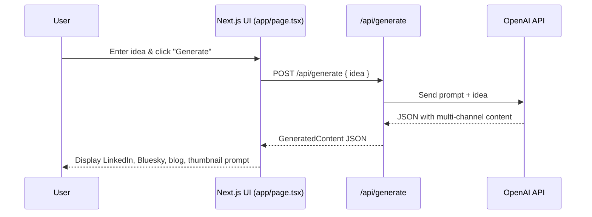
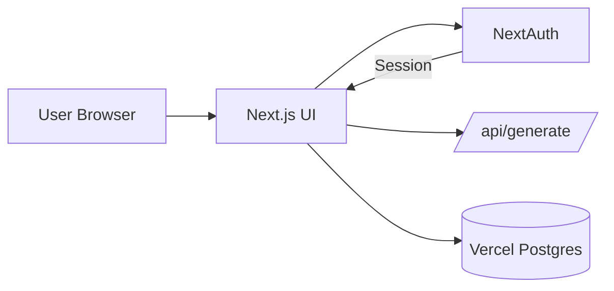
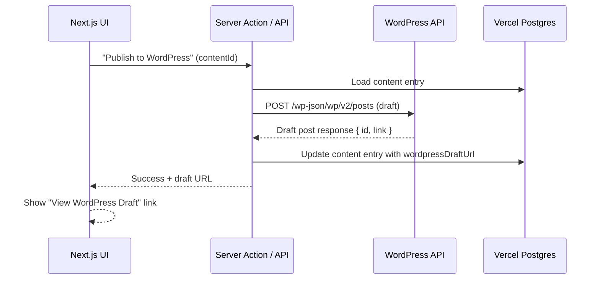

# Content Flow Architecture

This document describes the high-level architecture of the **Content Flow** application: how the frontend, backend, database, and external services fit together.

---

## 1. High-Level Overview

Content Flow is a full-stack web application built with:

- **Frontend & Backend Framework**: Next.js 16 (App Router, TypeScript, React 19)
- **Styling**: Tailwind CSS v4
- **AI Integration**: OpenAI API
- **CMS Integration**: WordPress REST API
- **Database**: Vercel Postgres
- **Auth (later phase)**: NextAuth
- **Hosting**: Vercel

At a high level:

```mermaid
flowchart LR
  A[User Browser] --> B[Next.js App (Vercel)]
  B --> C[/OpenAI API/]
  B --> D[(Vercel Postgres)]
  B --> E[/WordPress REST API/]
```

- The **user** interacts with the Next.js app.
- Next.js server components and API routes handle:
  - Content generation via **OpenAI**
  - Persistence via **Vercel Postgres**
  - Draft publishing via **WordPress REST API**

---

## 2. Request Flow: Idea → Multi-Channel Content

### Step-by-step

1. **User submits an idea** in the UI (`app/page.tsx`).
2. The client sends a request to `/api/generate`.
3. The **`generate` API route**:
   - Builds a prompt for OpenAI
   - Calls the OpenAI Responses API
   - Receives structured JSON output
4. The API responds to the client with a `GeneratedContent` object:
   ```ts
   interface GeneratedContent {
     linkedin: string;
     bluesky: string;
     blogTitle: string;
     blogBody: string;
     metaDescription: string;
     thumbnailPrompt: string;
   }
   ```
5. The UI renders each output block with copy buttons.
6. In a later phase, the app:
   - Persists this record to **Vercel Postgres**
   - Optionally sends the blog post to **WordPress** as a draft.

### Diagram



---

## 3. Application Layers

```mermaid
flowchart TB
  subgraph Frontend
    UI[App Router Pages & Components]
  end

  subgraph Backend
    API[API Routes (app/api/*)]
    SA[Server Actions (later)]
  end

  subgraph Infrastructure
    DB[(Vercel Postgres)]
    WP[/WordPress REST API/]
    OA[/OpenAI API/]
  end

  UI --> API
  UI --> SA
  API --> OA
  API --> DB
  SA --> DB
  SA --> WP
```

### Frontend (App Router)

- `app/layout.tsx`  
  - Global layout, fonts, metadata, base styling
- `app/page.tsx`  
  - Idea input form
  - Loading state (button disabled)
  - Generated content display

### Backend

- `app/api/generate/route.ts`  
  - POST handler
  - Calls OpenAI
  - Returns `GeneratedContent` JSON
- Future:
  - Server actions for DB persistence and WordPress publishing

### External Services

- **OpenAI**: text generation for all content outputs
- **WordPress**: blog draft publishing via REST API
- **Vercel Postgres**: storage for generated content and user history

---

## 4. Data Model

Primary table: `content_entries`

| column            | type     | description                               |
|-------------------|----------|-------------------------------------------|
| id                | uuid     | Primary key                               |
| userId            | uuid     | Owner (from NextAuth, later)             |
| idea              | text     | Original idea text                        |
| linkedin          | text     | Generated LinkedIn post                   |
| bluesky           | text     | Generated Bluesky post                    |
| blogTitle         | text     | Blog post title                           |
| blogBody          | text     | Blog content                              |
| metaDescription   | text     | SEO meta description                      |
| thumbnailPrompt   | text     | Prompt for thumbnail image generation     |
| wordpressDraftUrl | text     | URL to WordPress draft (optional)        |
| created_at        | timestamp| Creation timestamp                        |

Future tables (optional):

- `users` (if not relying solely on NextAuth internal tables)
- `user_settings` (per-user WordPress settings, preferences, etc.)

---

## 5. Authentication Flow (Future Phase)

Once NextAuth is added:



- Users authenticate (e.g., GitHub or email).
- Session data contains a `userId`.
- All content entries are stored with `userId`.
- WordPress configuration and credentials are scoped per user.

---

## 6. WordPress Integration Flow



---

## 7. Error Handling & UX

- API routes return JSON error payloads with HTTP status codes.
- The frontend shows:
  - Toast notifications on failure
  - Inline error messages under affected sections
- Buttons are disabled while API calls are in-flight (`isLoading` pattern).

This keeps the system predictable and supports **learning through visible feedback**.

---

## 8. AI Assistant Integration (Dev Workflow)

AI is used to assist development, not to own the codebase.

- **GitHub Copilot Agents**  
  - Configured via `.github/copilot-instructions.md`  
  - Enforces small, incremental changes and simple patterns  

- **Claude Sonnet 4.5**  
  - Guided by `docs/claude-brief.md`  
  - Used for explanation, architecture, and refactoring guidance  

They help shape the architecture and implementation while the developer remains in control.

---

## 9. Summary

Content Flow is intentionally **simple but structured**:

- Clear separation between UI, API, and integrations
- Stable data model for history and publishing
- Expandable design for future features (streaming, scheduling, more channels)
- Built to be a **real tool** and a **learning environment** at the same time

As the project grows, this architecture can evolve toward:

- More robust background job handling
- Scheduling and queueing
- Multi-tenant SaaS structure

For now, the priority is **clarity, maintainability, and incremental learning**.
