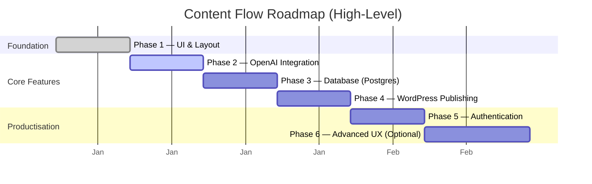
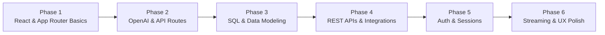

# Content Flow — Visual Roadmap

This document provides a *visual* view of the Content Flow roadmap using Mermaid diagrams.

It complements `roadmap.md` by showing phases, dependencies, and progression at a glance.

---

## 1. Phase Timeline



> Dates are illustrative. The important part is the **sequence**: each phase builds on the last.

---

## 2. Phase Dependency Graph

```mermaid
flowchart LR
    P1[Phase 1<br/>UI & Layout] --> P2[Phase 2<br/>OpenAI Integration]
    P2 --> P3[Phase 3<br/>Database]
    P3 --> P4[Phase 4<br/>WordPress]
    P4 --> P5[Phase 5<br/>Authentication]
    P5 --> P6[Phase 6<br/>Advanced UX (Optional)]
```

- **Phase 1**: Foundational UI; everything depends on this.
- **Phase 2**: Adds the core content engine (OpenAI).
- **Phase 3**: Adds persistence and history.
- **Phase 4**: Connects to WordPress for real publishing.
- **Phase 5**: Enables multi-user and per-user settings.
- **Phase 6**: Optional polish and advanced UX.

---

## 3. Feature Focus by Phase

```mermaid
flowchart TB
    subgraph Phase 1 — Foundation
      A1[Layout & Shell]
      A2[Idea Input Form]
      A3[Preview Area]
    end

    subgraph Phase 2 — OpenAI
      B1[API Route /api/generate]
      B2[Prompt Template]
      B3[GeneratedContent JSON]
      B4[Display Outputs]
    end

    subgraph Phase 3 — Database
      C1[Postgres Schema]
      C2[Save Entries]
      C3[History Page]
    end

    subgraph Phase 4 — WordPress
      D1[WP Auth Settings]
      D2[Create Draft via REST]
      D3[Store Draft URL]
      D4[View Draft Link]
    end

    subgraph Phase 5 — Auth
      E1[NextAuth Setup]
      E2[Protected Routes]
      E3[Per-User Settings]
    end

    subgraph Phase 6 — Advanced UX
      F1[Streaming (Optional)]
      F2[Better Previews]
      F3[Image/Thumbnail Generation]
    end
```

This view emphasises **what** is being built in each phase rather than **when**.

---

## 4. Learning Focus by Phase



Each phase deepens a different area of your stack:

- **Phase 1**: React + Next.js structure  
- **Phase 2**: AI integration + prompt design  
- **Phase 3**: Database fundamentals  
- **Phase 4**: External service integration  
- **Phase 5**: Authentication and multi-user design  
- **Phase 6**: UX excellence and advanced features  

---

## 5. How to Use This Roadmap

- Pick **one phase** and treat it as a mini-project.  
- Use `roadmap.md` for task-level detail.  
- Use this file to keep the big picture in view while you’re in the weeds.  

Content Flow is meant to move **slowly and steadily** through these stages, focusing on understanding over speed.
